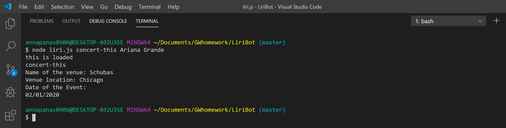
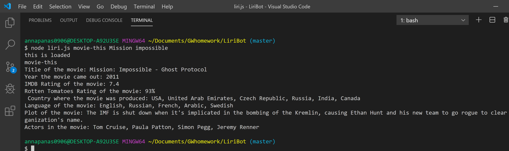
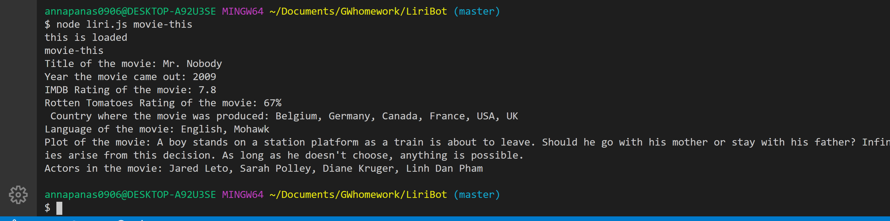
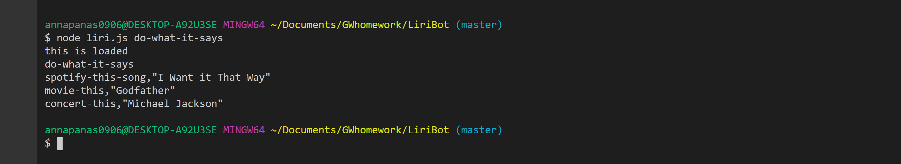

# LiriBot
LiriBot is a command line application yhat takes in parameters and gives you back data.

Liri is built on data from following API's and node packages:

1. Node-Spotify-API

In command line type in: node liri.js spotify-this-song 'song name here'
and you will get this data back in your terminal:

Artist(s);

The song's name;

A preview link of the song from Spotify;

The album that the song is from;

2.  OMDB API 

In command line type in: node liri.js movie-this 'movie name here'
and you will get this data back in your terminal:

  * Title of the movie.
  * Year the movie came out.
  * IMDB Rating of the movie.
  * Rotten Tomatoes Rating of the movie.
  * Country where the movie was produced.
  * Language of the movie.
  * Plot of the movie.
  * Actors in the movie.

  

If you don't type in any movie in a command line, you'll get back data for movie "Mr Nobody"

3.  Bands In Town API

In command line type in: node liri.js concert-this 'artist/band name here'
and you will get this data back in your terminal: 

Name of the venue

Venue location

Date of the Event in this moment  format: "MM/DD/YYYY"

4. fs Node package

In command line type in: node liri.js  do-what-it-says
and you will get text from random.txt file in your terminal: 

spotify-this-song,"I Want it That Way"
movie-this,"Godfather"
concert-this,"Michael Jackson"

